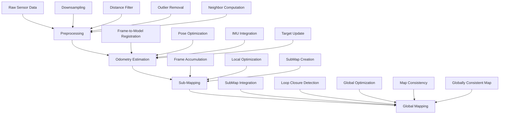

# Phân Tích Luồng Hoạt Động Module GLIM

## 1. Tổng Quan Về GLIM

**GLIM (Graph-based LiDAR-Inertial Mapping)** là một framework 3D mapping linh hoạt và mở rộng, được thiết kế cho SLAM (Simultaneous Localization and Mapping) thời gian thực chính xác sử dụng sensor LiDAR và IMU.

### Đặc Điểm Chính:
- **Tính Chính Xác**: Dựa trên tối ưu hóa lỗi registration trực tiếp multi-scan trên factor graphs
- **Dễ Sử Dụng**: Cung cấp giao diện chỉnh sửa bản đồ tương tác
- **Tính Linh Hoạt**: Hỗ trợ nhiều loại range sensor (LiDAR quay, solid-state LiDAR, RGB-D camera)
- **Khả Năng Mở Rộng**: Cung cấp cơ chế callback toàn cục cho việc chèn ràng buộc bổ sung

## 2. Kiến Trúc Tổng Thể

### Cấu Trúc Thư Mục Chính:
```
glim/
├── include/glim/
│   ├── common/          # Tiện ích chung (IMU, deskewing, covariance)
│   ├── mapping/         # Sub-mapping và global mapping
│   ├── odometry/        # Thuật toán ước lượng pose
│   ├── preprocess/      # Tiền xử lý point cloud
│   ├── util/           # Tiện ích cốt lõi
│   └── viewer/         # Component hiển thị
├── src/glim/           # Implementation files
├── config/             # File cấu hình JSON
└── thirdparty/         # Dependencies bên ngoài
```

## 3. Luồng Hoạt Động Chính (Main Pipeline)

GLIM tuân theo một pipeline xử lý 4 giai đoạn chính:

### 3.1. Giai Đoạn 1: Tiền Xử Lý (Preprocessing)

**Vị trí**: `src/glim/preprocess/cloud_preprocessor.cpp`

**Chức năng chính**:
1. **Downsampling**: 
   - Sử dụng voxel grid hoặc random sampling
   - Giảm số lượng điểm để tăng hiệu quả tính toán
   - Tham số: `downsample_resolution`, `downsample_rate`

2. **Distance Filtering**:
   - Lọc điểm theo khoảng cách gần/xa
   - Loại bỏ điểm không hợp lệ
   - Tham số: `distance_near_thresh`, `distance_far_thresh`

3. **Outlier Removal**:
   - Phát hiện và loại bỏ outlier dựa trên thống kê k-NN
   - Tham số: `outlier_removal_k`, `outlier_std_mul_factor`

4. **Crop Box Filtering**:
   - Lọc vùng hình học cụ thể
   - Hỗ trợ frame tọa độ lidar hoặc IMU

5. **Neighbor Computation**:
   - Tính toán k nearest neighbors cho mỗi điểm
   - Sử dụng KdTree cho tìm kiếm nhanh
   - Chuẩn bị dữ liệu cho thuật toán registration

**Input**: `RawPoints` (dữ liệu sensor thô với timestamp và intensity)  
**Output**: `PreprocessedFrame` (point cloud đã lọc với neighbor information)

### 3.2. Giai Đoạn 2: Ước Lượng Odometry

**Vị trí**: `src/glim/odometry/`

**Thuật toán hỗ trợ**:
- **GICP (Generalized ICP)**: Point-to-plane registration với covariance
- **VGICP (Voxelized GICP)**: Version GPU-accelerated của GICP
- **Continuous-time estimation**: Cho non-repetitive scan patterns

**Quy trình hoạt động**:

1. **Frame-to-Model Registration**:
   ```cpp
   // Tạo matching factor cho frame hiện tại với target model
   auto gicp_factor = gtsam::make_shared<gtsam_points::IntegratedGICPFactor_>(
       gtsam::Pose3(), X(current), target_ivox, frames[current]->frame, target_ivox);
   ```

2. **Pose Optimization**:
   - Sử dụng Levenberg-Marquardt optimizer
   - Tối ưu hóa pose sao cho minimize registration error
   - Tích hợp dữ liệu IMU nếu có

3. **Target Model Update**:
   - Cập nhật target point cloud với frame mới đã được transform
   - Sử dụng LRU cache để quản lý bộ nhớ

4. **IMU Integration** (nếu enabled):
   - Tích hợp dữ liệu IMU cho prediction ban đầu
   - Cải thiện độ chính xác ước lượng pose

**Input**: `PreprocessedFrame`  
**Output**: `EstimationFrame` (kết quả ước lượng pose với deskewed points)

### 3.3. Giai Đoạn 3: Sub-Mapping

**Vị trí**: `src/glim/mapping/sub_mapping.cpp`

**Chức năng**:
1. **Frame Accumulation**:
   - Thu thập và lưu trữ multiple estimation frames
   - Tạo local map từ keyframes

2. **Local Optimization**:
   ```cpp
   // Tối ưu hóa poses trong submap
   gtsam_points::LevenbergMarquardtOptimizerExt optimizer(*graph, *values, lm_params);
   gtsam::Values optimized = optimizer.optimize();
   ```

3. **SubMap Creation**:
   - Merge các frame đã được tối ưu
   - Tính toán transformation endpoints
   - Tạo voxel maps cho global mapping

4. **Memory Management**:
   - Giải phóng frame points sau khi tạo submap
   - Quản lý bộ nhớ hiệu quả

**Input**: Multiple `EstimationFrame`s  
**Output**: `SubMap` (bản đồ local với aggregated data)

### 3.4. Giai Đoạn 4: Global Mapping

**Vị trí**: `src/glim/mapping/global_mapping.cpp`

**Chức năng chính**:

1. **SubMap Integration**:
   ```cpp
   // Chèn submap mới vào global graph
   void GlobalMapping::insert_submap(const SubMap::Ptr& submap) {
       // Tính toán pose prediction dựa trên submap trước
       const Eigen::Isometry3d T_origin0_origin1 = T_origin0_endpointR0 * T_endpointR0_endpointL1 * T_origin1_endpointL1.inverse();
       current_T_world_submap = last_T_world_submap * gtsam::Pose3(T_origin0_origin1.matrix());
   }
   ```

2. **Loop Closure Detection**:
   - Phát hiện implicit loop dựa trên khoảng cách và overlap
   - Tạo between factors giữa các submap

3. **Global Optimization**:
   - Sử dụng GTSAM iSAM2 cho incremental optimization
   - Duy trì tính nhất quán toàn cục của bản đồ
   - Tối ưu hóa pose graph với registration error factors

4. **Adaptive Voxel Resolution**:
   ```cpp
   // Điều chỉnh độ phân giải voxel dựa trên median distance
   const double dist_median = gtsam_points::median_distance(submap->frame, max_scan_count);
   const double p = std::max(0.0, std::min(1.0, (dist_median - params.submap_voxel_resolution_dmin) / 
                    (params.submap_voxel_resolution_dmax - params.submap_voxel_resolution_dmin)));
   ```

**Input**: `SubMap`  
**Output**: Globally consistent map với optimized poses

## 4. Cấu Trúc Dữ Liệu Chính

### 4.1. RawPoints
- Dữ liệu sensor thô với timestamp và intensity
- Input đầu tiên vào pipeline

### 4.2. PreprocessedFrame  
- Point cloud đã được lọc và downsampled
- Chứa neighbor information cho registration

### 4.3. EstimationFrame
- Kết quả từ odometry estimation  
- Bao gồm estimated pose và deskewed points

### 4.4. SubMap
- Bản đồ local được tạo từ multiple frames
- Chứa optimized poses và aggregated point cloud

## 5. Tối Ưu Hóa và Hiệu Suất

### 5.1. GPU Acceleration
- **CUDA Support**: Tăng tốc VGICP và các operations khác
- **GPU Memory Management**: Quản lý hiệu quả memory trên GPU
- **Parallel Processing**: Sử dụng CUDA streams và kernels

### 5.2. CPU Optimization  
- **Multi-threading**: Sử dụng OpenMP và TBB
- **Memory Management**: Smart pointers và LRU caching
- **SIMD Instructions**: Tối ưu các phép toán vector

### 5.3. Memory Management
- **Voxel Grid Downsampling**: Giảm memory footprint
- **LRU Caching**: Cho target point clouds
- **Streaming Processing**: Xử lý dataset lớn
- **Smart Pointer**: Tự động cleanup memory

## 6. Cấu Hình và Tham Số

### 6.1. File Cấu Hình Chính

**config.json**: Cấu hình pipeline toàn cục
```json
{
  "config_odometry": "config_odometry_gpu.json",
  "config_sub_mapping": "config_sub_mapping_gpu.json", 
  "config_global_mapping": "config_global_mapping_gpu.json"
}
```

**config_sensors.json**: Cấu hình sensor
```json
{
  "T_lidar_imu": [-0.006, 0.012, -0.008, 0, 0, 0, 1],
  "global_shutter_lidar": false
}
```

### 6.2. Tham Số Quan Trọng

**Preprocessing**:
- `downsample_resolution`: Kích thước voxel
- `distance_near_thresh`, `distance_far_thresh`: Ngưỡng khoảng cách
- `k_correspondences`: Số neighbor cho registration

**Odometry**:
- `registration_type`: "GICP" hoặc "VGICP"
- `max_iterations`: Số iteration tối đa cho optimization
- `target_downsampling_rate`: Tỷ lệ downsample target model

**Global Mapping**:
- `submap_voxel_resolution`: Độ phân giải voxel submap
- `max_implicit_loop_distance`: Khoảng cách tối đa cho loop detection
- `min_implicit_loop_overlap`: Overlap tối thiểu cho loop closure

## 7. Tích Hợp và Mở Rộng

### 7.1. ROS Integration
- **glim_rosnode**: ROS node standard subscribe topics
- **glim_rosbag**: Direct rosbag processing với speed adjustment
- **Visualization**: Integration với RViz

### 7.2. Callback Mechanism
```cpp
// Global callback slots cho extension
Callbacks::on_new_frame(new_frame);
Callbacks::on_insert_submap(submap);
Callbacks::on_optimize_submap(*graph, *values);
```

### 7.3. Plugin Architecture
- Extensible modules cho odometry, mapping, và visualization
- Support cho custom registration algorithms
- Integration với external optimization libraries

## 8. Workflow Diagram



## 9. Kết Luận

GLIM cung cấp một pipeline mapping hoàn chỉnh và hiệu quả với các đặc điểm:

1. **Modular Design**: Kiến trúc module rõ ràng, dễ bảo trì và mở rộng
2. **Performance Optimization**: Hỗ trợ cả CPU và GPU acceleration
3. **Robustness**: Xử lý nhiều loại sensor và điều kiện khác nhau  
4. **Flexibility**: Cấu hình linh hoạt và plugin architecture
5. **Real-time Capability**: Tối ưu cho ứng dụng thời gian thực

Pipeline này cho phép tạo ra bản đồ 3D chính xác và nhất quán từ dữ liệu LiDAR và IMU trong thời gian thực, phù hợp cho các ứng dụng robotics, autonomous vehicles, và mapping applications khác. 