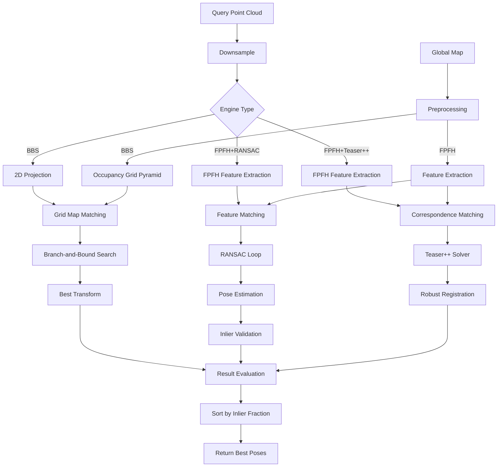

# Phân Tích Workflow Thuật Toán HDL Global Localization

## 1. Tổng Quan Về HDL Global Localization

**HDL Global Localization** là một ROS package cung cấp khả năng định vị toàn cục (global localization) cho robot trong môi trường đã biết. Hệ thống này giải quyết bài toán "kidnapped robot problem" - xác định vị trí robot trong bản đồ khi không biết vị trí ban đầu.

### Đặc Điểm Chính:
- **Multiple Algorithm Support**: Hỗ trợ 3 thuật toán chính (BBS, FPFH+RANSAC, FPFH+Teaser++)
- **Real-time Performance**: Tối ưu cho ứng dụng thời gian thực
- **Service-based Interface**: Cung cấp ROS services cho integration dễ dàng
- **Robust Registration**: Sử dụng feature-based matching với outlier rejection
- **Hierarchical Search**: Branch-and-Bound search cho efficiency

## 2. Kiến Trúc Hệ Thống

### 2.1. Cấu Trúc Module Chính
```
hdl_global_localization/
├── include/hdl_global_localization/
│   ├── engines/
│   │   ├── global_localization_engine.hpp        # Base engine interface
│   │   ├── global_localization_bbs.hpp           # BBS engine
│   │   ├── global_localization_fpfh_ransac.hpp   # FPFH+RANSAC engine
│   │   └── global_localization_fpfh_teaser.hpp   # FPFH+Teaser++ engine
│   ├── bbs/
│   │   ├── bbs_localization.hpp                  # Branch-and-Bound Search
│   │   └── occupancy_gridmap.hpp                 # 2D grid map
│   ├── ransac/
│   │   ├── ransac_pose_estimation.hpp            # RANSAC pose estimation
│   │   └── matching_cost_evaluater_*.hpp         # Cost evaluation
│   └── global_localization_results.hpp           # Result structures
├── src/
│   ├── hdl_global_localization_node.cpp          # Main ROS node
│   ├── engines/                                  # Engine implementations
│   ├── bbs/                                      # BBS algorithm
│   └── ransac/                                   # RANSAC algorithm
├── srv/
│   ├── QueryGlobalLocalization.srv               # Main query service
│   ├── SetGlobalMap.srv                          # Set global map
│   └── SetGlobalLocalizationEngine.srv           # Engine selection
└── config/
    └── config_*.json                             # Configuration files
```

### 2.2. Dependencies Chính
- **PCL (Point Cloud Library)**: Point cloud processing
- **OpenCV**: Computer vision algorithms
- **OpenMP**: Parallel processing
- **Teaser++**: Robust registration (optional)
- **FLANN**: Fast approximate nearest neighbor search

## 3. Workflow Chính (Main Pipeline)

### 3.1. Khởi Tạo Hệ Thống

**Vị trí**: `hdl_global_localization_node.cpp:23-35`

**Các bước khởi tạo**:

1. **Engine Selection**:
   ```cpp
   bool set_engine(const std::string &engine_name) {
       if (engine_name == "BBS") {
           engine.reset(new GlobalLocalizationBBS(private_nh));
       } else if (engine_name == "FPFH_RANSAC") {
           engine.reset(new GlobalLocalizationEngineFPFH_RANSAC(private_nh));
       } else if (engine_name == "FPFH_TEASER") {
           engine.reset(new GlobalLocalizationEngineFPFH_Teaser(private_nh));
       }
   }
   ```

2. **Service Advertisement**:
   - `/hdl_global_localization/set_engine`: Chọn thuật toán
   - `/hdl_global_localization/set_global_map`: Load bản đồ toàn cục
   - `/hdl_global_localization/query`: Query global localization

3. **Global Map Loading**:
   ```cpp
   if (global_map) {
       engine->set_global_map(global_map);
   }
   ```

### 3.2. Giai Đoạn 1: Global Map Processing

**Interface**: `GlobalLocalizationEngine::set_global_map()`

Mỗi engine xử lý global map khác nhau:

#### BBS Engine:
```cpp
// Tạo occupancy grid pyramid từ point cloud
gridmap_pyramid.resize(pyramid_levels);
gridmap_pyramid[0].reset(new OccupancyGridMap(resolution, width, height));
gridmap_pyramid[0]->insert_points(map_points, max_points_per_cell);

for (int i = 1; i < pyramid_levels; i++) {
    gridmap_pyramid[i] = gridmap_pyramid[i - 1]->pyramid_up();
}
```

#### FPFH RANSAC Engine:
```cpp
// Extract FPFH features cho global map
global_map_features = extract_fpfh(cloud);
ransac.reset(new RansacPoseEstimation<pcl::FPFHSignature33>(params.ransac_params));
ransac->set_target(global_map, global_map_features);
```

### 3.3. Giai Đoạn 2: Query Processing

**Vị trí**: `hdl_global_localization_node.cpp:86-126`

**Query Workflow**:

1. **Input Validation**:
   ```cpp
   if (global_map == nullptr) {
       ROS_WARN_STREAM("No Globalmap");
       return false;
   }
   ```

2. **Point Cloud Preprocessing**:
   ```cpp
   pcl::PointCloud<pcl::PointXYZ>::Ptr cloud(new pcl::PointCloud<pcl::PointXYZ>);
   pcl::fromROSMsg(req.cloud, *cloud);
   cloud = downsample(cloud, query_downsample_resolution);
   ```

3. **Engine-specific Processing**:
   ```cpp
   auto results = engine->query(cloud, req.max_num_candidates);
   ```

4. **Result Formatting**:
   ```cpp
   for (int i = 0; i < results.results.size(); i++) {
       const auto &result = results.results[i];
       res.inlier_fractions[i] = result->inlier_fraction;
       res.errors[i] = result->error;
       res.poses[i] = convert_to_pose(result->pose);
   }
   ```

## 4. Thuật Toán Chi Tiết

### 4.1. Branch-and-Bound Search (BBS)

**Vị trí**: `bbs_localization.cpp:103-145`

**Nguyên lý hoạt động**:

1. **Discrete Transformation Space**:
   ```cpp
   struct DiscreteTransformation {
       int level;        // Pyramid level
       int x, y;         // Translation indices
       int theta;        // Rotation index
       double score;     // Matching score
   };
   ```

2. **Hierarchical Search**:
   ```cpp
   boost::optional<Eigen::Isometry2f> localize(const Points &scan_points, double min_score) {
       auto trans_queue = create_init_transset(scan_points);
       
       while (!trans_queue.empty()) {
           auto trans = trans_queue.top();
           trans_queue.pop();
           
           if (trans.score < best_score) continue;
           
           if (trans.is_leaf()) {
               best_trans = trans;
               best_score = trans.score;
           } else {
               auto children = trans.branch();
               for (auto &child : children) {
                   child.calc_score(scan_points, theta_resolution, gridmap_pyramid);
                   trans_queue.push(child);
               }
           }
       }
   }
   ```

3. **Score Calculation**:
   ```cpp
   double calc_score(const Points &points, double theta_resolution,
                     const std::vector<std::shared_ptr<OccupancyGridMap>> &gridmap_pyramid) {
       const auto &gridmap = gridmap_pyramid[level];
       auto transformed = transform(points, gridmap->grid_resolution(), theta_resolution);
       score = gridmap->calc_score(transformed);
       return score;
   }
   ```

4. **Multi-level Pyramid**:
   - Level cao: resolution thấp, search space rộng
   - Level thấp: resolution cao, search space hẹp
   - Branch factor: 4 (2x2 subdivision)

### 4.2. FPFH + RANSAC

**Vị trí**: `global_localization_fpfh_ransac.cpp` và `ransac_pose_estimation.cpp`

**Workflow**:

1. **FPFH Feature Extraction**:
   ```cpp
   pcl::PointCloud<pcl::FPFHSignature33>::ConstPtr extract_fpfh(pcl::PointCloud<pcl::PointXYZ>::ConstPtr cloud) {
       // Normal estimation
       pcl::NormalEstimationOMP<pcl::PointXYZ, pcl::Normal> nest;
       nest.setRadiusSearch(normal_estimation_radius);
       nest.compute(*normals);
       
       // FPFH computation
       pcl::FPFHEstimationOMP<pcl::PointXYZ, pcl::Normal, pcl::FPFHSignature33> fest;
       fest.setRadiusSearch(search_radius);
       fest.setInputNormals(normals);
       fest.compute(*features);
   }
   ```

2. **Feature Matching**:
   ```cpp
   // Precompute nearest features
   std::vector<std::vector<int>> similar_features(source->size());
   for (int i = 0; i < source->size(); i++) {
       feature_tree->nearestKSearch(source_features->at(i), 
                                    correspondence_randomness, 
                                    similar_features[i], sq_dists);
   }
   ```

3. **RANSAC Loop**:
   ```cpp
   for (int i = 0; i < max_iterations; i++) {
       // Select random samples
       select_samples(mt, similar_features, samples, correspondences);
       
       // Geometric consistency check
       if (!correspondence_rejection.thresholdPolygon(samples, correspondences)) {
           continue;
       }
       
       // Estimate transformation
       transformation_estimation.estimateRigidTransformation(*source, samples, 
                                                           *target, correspondences, 
                                                           transformation);
       
       // Evaluate transformation
       double inlier_fraction = 0.0;
       double matching_error = evaluater->calc_matching_error(*source, transformation, &inlier_fraction);
       
       if (inlier_fraction > min_inlier_fraction) {
           results[i].reset(new GlobalLocalizationResult(matching_error, inlier_fraction, 
                                                        Eigen::Isometry3f(transformation)));
       }
   }
   ```

4. **Correspondence Rejection**:
   - Polygon consistency test
   - Similarity threshold filtering
   - Geometric verification

### 4.3. FPFH + Teaser++

**Vị trí**: `global_localization_fpfh_teaser.cpp`

**Workflow**:

1. **Feature Matching**:
   ```cpp
   teaser::Matcher matcher;
   auto correspondences = matcher.calculateCorrespondences(
       source_cloud, target_cloud,
       source_features, target_features,
       false, cross_check, tuple_test, tuple_scale);
   ```

2. **Robust Registration**:
   ```cpp
   teaser::RobustRegistrationSolver::Params params;
   params.noise_bound = noise_bound;
   params.cbar2 = cbar2;
   params.estimate_scaling = false;
   params.rotation_estimation_algorithm = teaser::GNC_TLS;
   
   teaser::RobustRegistrationSolver solver(params);
   solver.solve(source_cloud, target_cloud, correspondences);
   ```

3. **Solution Evaluation**:
   ```cpp
   auto solution = solver.getSolution();
   Eigen::Isometry3f transformation = Eigen::Isometry3f::Identity();
   transformation.linear() = solution.rotation.cast<float>();
   transformation.translation() = solution.translation.cast<float>();
   
   double inlier_fraction = 0.0;
   double error = evaluater->calc_matching_error(*cloud, transformation.matrix(), &inlier_fraction);
   ```

## 5. Cấu Hình Hệ Thống

### 5.1. BBS Configuration

**File**: `config_bbs.json`
```json
{
  "bbs": {
    "max_range": 15.0,           // Maximum sensor range
    "min_tx": -50.0,             // Translation search bounds
    "max_tx": 50.0,
    "min_ty": -50.0,
    "max_ty": 50.0,
    "min_theta": -3.15,          // Rotation search bounds
    "max_theta": 3.15,
    "map_resolution": 0.5,       // Grid map resolution
    "map_pyramid_level": 6,      // Number of pyramid levels
    "max_points_per_cell": 5     // Occupancy grid density
  }
}
```

### 5.2. FPFH RANSAC Configuration
- `normal_estimation_radius`: Radius cho normal estimation
- `search_radius`: FPFH feature computation radius
- `max_iterations`: Số iteration RANSAC
- `correspondence_randomness`: K nearest neighbors
- `similarity_threshold`: Geometric consistency threshold
- `min_inlier_fraction`: Minimum inlier ratio
- `max_correspondence_distance`: Distance threshold

### 5.3. Teaser++ Configuration
- `noise_bound`: Noise level assumption
- `cbar2`: Outlier threshold
- `rotation_max_iterations`: GNC-TLS iterations
- `rotation_gnc_factor`: GNC factor
- `rotation_cost_threshold`: Convergence threshold

## 6. Service Interface

### 6.1. Query Service

**Definition**: `QueryGlobalLocalization.srv`
```
# Request
int64 max_num_candidates
sensor_msgs/PointCloud2 cloud
---
# Response
std_msgs/Header header
std_msgs/Header globalmap_header
float64[] inlier_fractions
float64[] errors
geometry_msgs/Pose[] poses
```

**Usage Example**:
```cpp
auto request = std::make_shared<hdl_global_localization::srv::QueryGlobalLocalization::Request>();
pcl::toROSMsg(*scan, request->cloud);
request->max_num_candidates = 1;

auto response = query_client->invoke(request, std::chrono::seconds(15));
if (response && !response->poses.empty()) {
    auto best_pose = response->poses[0];
    auto best_error = response->errors[0];
    auto best_inlier_fraction = response->inlier_fractions[0];
}
```

### 6.2. Configuration Services

**Set Engine**:
```
std_msgs/String engine_name  # "BBS", "FPFH_RANSAC", "FPFH_TEASER"
```

**Set Global Map**:
```
sensor_msgs/PointCloud2 global_map
```

## 7. Result Processing và Ranking

### 7.1. Result Structure

```cpp
struct GlobalLocalizationResult {
    double error;                    // Matching error
    double inlier_fraction;          // Inlier ratio
    Eigen::Isometry3f pose;          // Estimated pose
};
```

### 7.2. Result Sorting

**Vị trí**: `global_localization_results.hpp:26-39`

```cpp
GlobalLocalizationResults& sort(int max_num_candidates) {
    // Remove invalid results
    auto remove_loc = std::remove_if(results.begin(), results.end(), 
                                    [](const auto& result) { return result == nullptr; });
    results.erase(remove_loc, results.end());
    
    // Sort by inlier fraction (descending)
    std::sort(results.begin(), results.end(), 
             [](const auto& lhs, const auto& rhs) { 
                 return lhs->inlier_fraction > rhs->inlier_fraction; 
             });
    
    // Limit to max candidates
    if (results.size() > max_num_candidates) {
        results.erase(results.begin() + max_num_candidates, results.end());
    }
}
```

## 8. Performance Characteristics

### 8.1. Algorithm Comparison

| Algorithm | Accuracy | Speed | Memory | Robustness |
|-----------|----------|-------|---------|------------|
| BBS | High | Fast | Low | Medium |
| FPFH+RANSAC | Medium | Medium | Medium | High |
| FPFH+Teaser++ | High | Slow | High | Very High |

### 8.2. Computational Complexity

**BBS**:
- Time: O(log(search_space))
- Space: O(map_size)
- Parallel: OpenMP trong score calculation

**FPFH+RANSAC**:
- Time: O(iterations × correspondence_matching)
- Space: O(feature_size)
- Parallel: OpenMP trong RANSAC loop

**FPFH+Teaser++**:
- Time: O(correspondence_computation + GNC_iterations)
- Space: O(correspondences)
- Parallel: Limited

## 9. Data Flow Diagram



## 10. Error Handling và Validation

### 10.1. Input Validation
```cpp
// Point cloud validation
if (cloud->empty()) {
    ROS_ERROR("Empty point cloud received");
    return false;
}

// Global map validation
if (global_map == nullptr) {
    ROS_WARN("No global map set");
    return false;
}
```

### 10.2. Result Validation
```cpp
// Geometric consistency
if (!correspondence_rejection.thresholdPolygon(samples, correspondences)) {
    continue;  // Skip this iteration
}

// Inlier fraction threshold
if (inlier_fraction > min_inlier_fraction) {
    // Accept result
    results[i].reset(new GlobalLocalizationResult(...));
}
```

### 10.3. Timeout Handling
- Service call timeouts
- Algorithm iteration limits
- Memory usage monitoring

## 11. Integration với HDL Localization

### 11.1. Service Client
```cpp
// Trong hdl_localization
auto request = std::make_shared<hdl_global_localization::srv::QueryGlobalLocalization::Request>();
pcl::toROSMsg(*scan, request->cloud);
request->max_num_candidates = 1;

auto response = query_global_localization_client_->invoke(request, std::chrono::seconds(15));
if (response && !response->poses.empty()) {
    // Reset pose estimator với global pose
    auto global_pose = response->poses[0];
    pose_estimator_->reset(global_pose);
}
```

### 11.2. Fallback Mechanism
- Automatic trigger khi tracking thất bại
- Quality metrics monitoring
- Smooth transition từ global về local tracking

## 12. Workflow Summary

HDL Global Localization workflow bao gồm các bước chính:

1. **Engine Selection**: Chọn thuật toán phù hợp (BBS/FPFH+RANSAC/FPFH+Teaser++)
2. **Global Map Processing**: Preprocessing bản đồ cho engine cụ thể
3. **Query Processing**: Nhận point cloud và downsample
4. **Algorithm Execution**: Chạy thuật toán localization được chọn
5. **Result Ranking**: Sort kết quả theo inlier fraction
6. **Response Generation**: Trả về các pose candidates tốt nhất

Hệ thống này cung cấp khả năng global localization robust và efficient, phù hợp cho việc giải quyết kidnapped robot problem trong các ứng dụng robotics thực tế. 