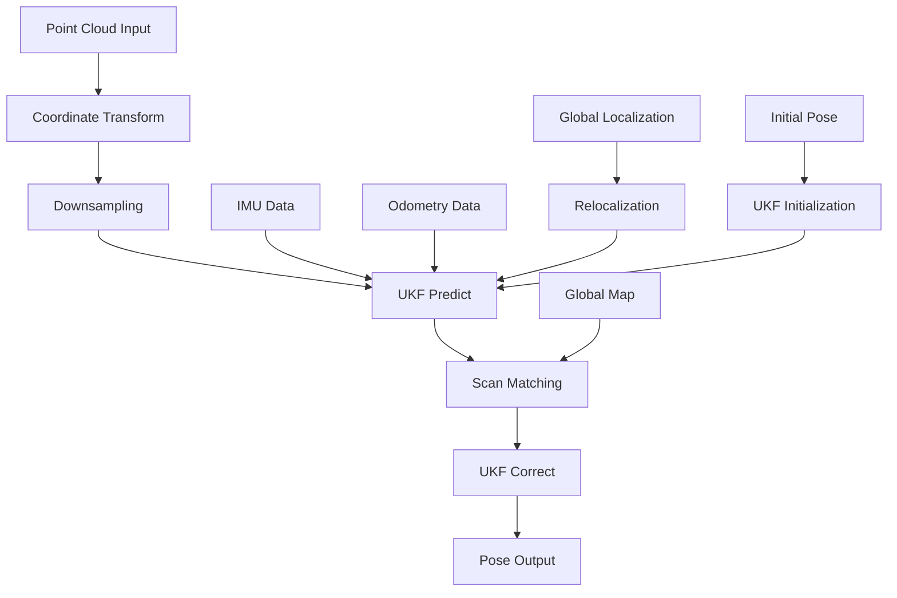

# Phân Tích Workflow Thuật Toán HDL Localization

## 1. Tổng Quan Về HDL Localization

**HDL Localization** là một ROS2 package cung cấp khả năng định vị 3D thời gian thực sử dụng dữ liệu point cloud từ sensor LiDAR. Đây là hệ thống localization dựa trên việc so khớp point cloud hiện tại với bản đồ toàn cục đã có sẵn.

### Đặc Điểm Chính:
- **Real-time 3D Localization**: Định vị thời gian thực trong không gian 3D
- **Multi-algorithm Support**: Hỗ trợ nhiều thuật toán registration (NDT, GICP)
- **IMU Integration**: Tích hợp dữ liệu IMU để cải thiện prediction
- **Global Localization**: Hỗ trợ định vị toàn cục khi mất tracking
- **Robust Prediction**: Sử dụng Unscented Kalman Filter (UKF) cho pose estimation

## 2. Kiến Trúc Hệ Thống

### 2.1. Cấu Trúc Module Chính
```
hdl_localization/
├── include/hdl_localization/
│   ├── hdl_localization_node.hpp    # Node chính
│   ├── pose_estimator.hpp           # UKF-based pose estimator
│   ├── pose_system.hpp              # System model cho UKF
│   ├── odom_system.hpp              # Odometry system model
│   └── delta_estimater.hpp          # Global relocalization
├── src/
│   ├── hdl_localization_node.cpp    # Implementation node chính
│   ├── pose_estimator.cpp           # Core localization logic
│   └── globalmap_server_node.cpp    # Map server
├── config/
│   └── hdl_localization_params.yaml # Cấu hình tham số
└── launch/
    └── hdl_localization.launch.py   # Launch file
```

### 2.2. Dependencies Chính
- **PCL (Point Cloud Library)**: Xử lý point cloud
- **fast_gicp**: GICP registration algorithms
- **ndt_omp**: NDT registration với OpenMP
- **hdl_global_localization**: Global localization service
- **UKF Library**: Unscented Kalman Filter implementation

## 3. Workflow Chính (Main Pipeline)

### 3.1. Khởi Tạo Hệ Thống

**Vị trí**: `hdl_localization_node.cpp:178-275`

**Các bước khởi tạo**:

1. **Parameter Declaration**:
   ```cpp
   // Thuật toán registration
   this->declare_parameter<std::string>("reg_method", "NDT_CUDA");
   this->declare_parameter<double>("ndt_resolution", 1.0);
   this->declare_parameter<double>("downsample_resolution", 0.1);
   
   // Pose ban đầu
   this->declare_parameter<bool>("specify_init_pose", true);
   this->declare_parameter<double>("init_pos_x", 0.0);
   ```

2. **Registration Method Creation**:
   - Tạo registration algorithm (NDT/GICP)
   - Cấu hình downsampling filter
   - Khởi tạo global localization service

3. **Pose Estimator Initialization**:
   ```cpp
   pose_estimator_.reset(new hdl_localization::PoseEstimator(
       registration_,
       Eigen::Vector3f(init_pos_x, init_pos_y, init_pos_z),
       Eigen::Quaternionf(init_ori_w, init_ori_x, init_ori_y, init_ori_z),
       cool_time_duration));
   ```

### 3.2. Giai Đoạn 1: Nhận và Tiền Xử Lý Point Cloud

**Vị trí**: `hdl_localization_node.cpp:278-394`

**Quy trình xử lý**:

1. **Point Cloud Reception**:
   ```cpp
   void points_callback(const sensor_msgs::msg::PointCloud2::SharedPtr points_msg) {
       // Kiểm tra global map đã load
       if (!globalmap_) {
           RCLCPP_ERROR(this->get_logger(), "globalmap has not been received!!");
           return;
       }
   ```

2. **Coordinate Transform**:
   - Transform point cloud vào frame `odom_child_frame_id`
   - Sử dụng TF2 để transform coordinate

3. **Downsampling**:
   ```cpp
   auto filtered = downsample(cloud);
   last_scan_ = filtered;
   ```
   - Áp dụng voxel grid filter để giảm số lượng điểm
   - Tăng hiệu quả tính toán

### 3.3. Giai Đoạn 2: Prediction (UKF Predict Step)

**Vị trí**: `pose_estimator.cpp:61-111`

**Prediction Methods**:

1. **IMU-based Prediction**:
   ```cpp
   void PoseEstimator::predict(const rclcpp::Time &stamp, 
                               const Eigen::Vector3f &acc,
                               const Eigen::Vector3f &gyro) {
       ukf->setProcessNoiseCov(process_noise * dt);
       ukf->system.dt = dt;
       
       Eigen::VectorXf control(6);
       control.head<3>() = acc;
       control.tail<3>() = gyro;
       
       ukf->predict(control);
   }
   ```

2. **Odometry-based Prediction**:
   ```cpp
   void PoseEstimator::predict_odom(const Eigen::Matrix4f &odom_delta) {
       // Tạo separate UKF cho odometry
       // Fusion với IMU prediction
   }
   ```

3. **State Vector Definition**:
   ```
   state = [px, py, pz, vx, vy, vz, qw, qx, qy, qz, 
            acc_bias_x, acc_bias_y, acc_bias_z, 
            gyro_bias_x, gyro_bias_y, gyro_bias_z]
   ```

### 3.4. Giai Đoạn 3: Scan Matching (Correction Step)

**Vị trí**: `pose_estimator.cpp:163-249`

**Scan Matching Process**:

1. **Initial Guess Generation**:
   ```cpp
   Eigen::Matrix4f no_guess = last_observation;    // Không prediction
   Eigen::Matrix4f imu_guess = matrix();           // IMU prediction
   Eigen::Matrix4f odom_guess = odom_matrix();     // Odometry prediction
   ```

2. **Multi-source Fusion**:
   ```cpp
   // Kết hợp IMU và Odometry predictions
   Eigen::MatrixXf fused_cov = (inv_imu_cov + inv_odom_cov).inverse();
   Eigen::VectorXf fused_mean = fused_cov * inv_imu_cov * imu_mean + 
                                fused_cov * inv_odom_cov * odom_mean;
   ```

3. **Registration Execution**:
   ```cpp
   pcl::PointCloud<PointT>::Ptr aligned(new pcl::PointCloud<PointT>());
   registration->setInputSource(cloud);
   registration->align(*aligned, init_guess);
   
   Eigen::Matrix4f trans = registration->getFinalTransformation();
   ```

4. **UKF Correction**:
   ```cpp
   Eigen::VectorXf observation(7);
   observation.middleRows(0, 3) = p;      // Position
   observation.middleRows(3, 4) = q_vec;  // Quaternion
   
   ukf->correct(observation);
   ```

### 3.5. Giai Đoạn 4: Global Relocalization (Fallback)

**Vị trí**: `hdl_localization_node.cpp:421-468`

**Global Localization Process**:

1. **Service Call**:
   ```cpp
   auto request = std::make_shared<hdl_global_localization::srv::QueryGlobalLocalization::Request>();
   pcl::toROSMsg(*scan, request->cloud);
   
   auto response = query_global_localization_client_->invoke(request, std::chrono::seconds(15));
   ```

2. **Delta Estimation**:
   ```cpp
   // DeltaEstimater class
   void add_frame(pcl::PointCloud<PointT>::ConstPtr frame) {
       reg->setInputTarget(last_frame);
       reg->setInputSource(frame);
       reg->align(aligned);
       
       delta = delta * Eigen::Isometry3f(reg->getFinalTransformation());
   }
   ```

3. **Pose Reset**:
   - Nhận global pose từ service
   - Reset UKF state với pose mới
   - Tiếp tục tracking từ vị trí mới

## 4. Unscented Kalman Filter (UKF) System

### 4.1. State Space Model

**Vị trí**: `pose_system.hpp:25-52`

**System Equation**:
```cpp
VectorXt f(const VectorXt &state, const VectorXt &control) const {
    // Position update
    next_state.middleRows(0, 3) = pt + vt * dt;
    
    // Velocity update (với IMU)
    Vector3t g(0.0f, 0.0f, 9.80665f);
    Vector3t acc_ = raw_acc - acc_bias;
    Vector3t acc = qt * acc_;
    next_state.middleRows(3, 3) = vt + (acc - g) * dt;
    
    // Orientation update
    Vector3t gyro_ = raw_gyro - gyro_bias;
    Quaterniont dq = Quaterniont(1, gyro_[0] * dt * 0.5, gyro_[1] * dt * 0.5, gyro_[2] * dt * 0.5);
    Quaterniont qt_ = (qt * dq).normalized();
}
```

### 4.2. Observation Model
```cpp
VectorXt h(const VectorXt &state) const {
    VectorXt observation(7);
    observation.middleRows(0, 3) = state.middleRows(0, 3);  // Position
    observation.middleRows(3, 4) = state.middleRows(6, 4);  // Quaternion
    return observation;
}
```

### 4.3. Noise Models
```cpp
// Process noise matrix
process_noise.middleRows(0, 3) *= 1.0;    // Position noise
process_noise.middleRows(3, 3) *= 1.0;    // Velocity noise  
process_noise.middleRows(6, 4) *= 0.5;    // Orientation noise
process_noise.middleRows(10, 3) *= 1e-6;  // Acc bias noise
process_noise.middleRows(13, 3) *= 1e-6;  // Gyro bias noise

// Measurement noise matrix
measurement_noise.middleRows(0, 3) *= 0.01;   // Position measurement
measurement_noise.middleRows(3, 4) *= 0.001;  // Orientation measurement
```

## 5. Registration Algorithms

### 5.1. Supported Methods
- **NDT (Normal Distribution Transform)**: CPU và CUDA versions
- **GICP (Generalized ICP)**: Fast GICP implementation
- **VGICP (Voxelized GICP)**: GPU-accelerated version

### 5.2. Algorithm Selection
```cpp
pcl::Registration<PointT, PointT>::Ptr create_registration() {
    std::string reg_method = this->get_parameter("reg_method").as_string();
    
    if (reg_method == "GICP") {
        return std::make_shared<fast_gicp::FastGICP<PointT, PointT>>();
    } else if (reg_method == "VGICP") {
        return std::make_shared<fast_gicp::FastVGICP<PointT, PointT>>();
    } else if (reg_method == "NDT") {
        // NDT implementation
    }
}
```

## 6. Cấu Hình Hệ Thống

### 6.1. File Cấu Hình Chính

**hdl_localization_params.yaml**:
```yaml
hdl_localization_node:
  ros__parameters:
    # Topics
    points_topic: /livox/lidar
    imu_topic: /livox/imu
    
    # Algorithm settings  
    reg_method: GICP
    ndt_resolution: 1.0
    downsample_resolution: 0.1
    
    # IMU settings
    use_imu: false
    invert_acc: false
    invert_gyro: false
    
    # Initial pose
    specify_init_pose: true
    init_pos_x: 0.0
    init_pos_y: 0.0
    init_pos_z: 0.0
```

### 6.2. Tham Số Quan Trọng

**Registration Parameters**:
- `reg_method`: Thuật toán registration ("NDT", "GICP", "VGICP")
- `ndt_resolution`: Độ phân giải NDT voxel
- `downsample_resolution`: Kích thước voxel cho downsampling

**UKF Parameters**:
- `cool_time_duration`: Thời gian không prediction sau initialization
- Process noise và measurement noise matrices

**Global Localization**:
- `use_global_localization`: Enable/disable global relocalization
- `max_num_candidates`: Số lượng candidate poses

## 7. Data Flow và Timing

### 7.1. Main Data Flow


### 7.2. Callback Sequence
1. **IMU Callback**: Continuous prediction updates
2. **Points Callback**: Main localization pipeline
3. **Initialpose Callback**: Reset pose estimator
4. **Global Localization Service**: Fallback relocalization

### 7.3. Threading và Synchronization
```cpp
std::lock_guard<std::mutex> estimator_lock(pose_estimator_mutex_);
// Thread-safe access to pose estimator
```

## 8. Error Handling và Robustness

### 8.1. Failure Detection
```cpp
// Check registration quality
double fitness_score = registration->getFitnessScore();
if (fitness_score > max_fitness_threshold) {
    // Trigger relocalization
    relocalize();
}
```

### 8.2. Prediction Error Tracking
```cpp
// Track prediction errors
wo_pred_error = no_guess.inverse() * registration->getFinalTransformation();
imu_pred_error = imu_guess.inverse() * registration->getFinalTransformation();
odom_pred_error = odom_guess.inverse() * registration->getFinalTransformation();
```

### 8.3. Automatic Relocalization
- Monitor tracking quality
- Automatic fallback to global localization
- Delta estimation during relocalization

## 9. Performance Optimization

### 9.1. Computational Efficiency
- **Downsampling**: Giảm point cloud size
- **Multi-threading**: OpenMP parallelization
- **GPU Acceleration**: CUDA-based NDT và VGICP

### 9.2. Memory Management
- Smart pointers cho point clouds
- Efficient data structures
- Cache-friendly algorithms

### 9.3. Real-time Considerations
- Asynchronous processing
- Timeout handling cho services
- Priority-based scheduling

## 10. Output và Monitoring

### 10.1. Published Topics
```cpp
// Main odometry output
pose_pub_ = this->create_publisher<nav_msgs::msg::Odometry>("/odom", 5);

// Aligned point cloud
aligned_pub_ = this->create_publisher<sensor_msgs::msg::PointCloud2>("/aligned_points", 5);

// Status information
status_pub_ = this->create_publisher<hdl_localization::msg::ScanMatchingStatus>("/status", 5);
```

### 10.2. Status Monitoring
```cpp
void publish_scan_matching_status(const std_msgs::msg::Header &header,
                                  const pcl::PointCloud<PointT>::ConstPtr &aligned) {
    // Fitness score, execution time, prediction errors
}
```

## 11. Workflow Summary

HDL Localization workflow bao gồm các bước chính:

1. **Initialization**: Load global map, khởi tạo UKF với pose ban đầu
2. **Continuous Prediction**: Sử dụng IMU/odometry để predict pose
3. **Scan Matching**: So khớp current scan với global map
4. **State Correction**: Update UKF với kết quả scan matching
5. **Global Relocalization**: Fallback mechanism khi tracking thất bại

Hệ thống này cung cấp localization chính xác và robust cho robot navigation trong môi trường đã được map trước, với khả năng tự recovery khi mất tracking. 